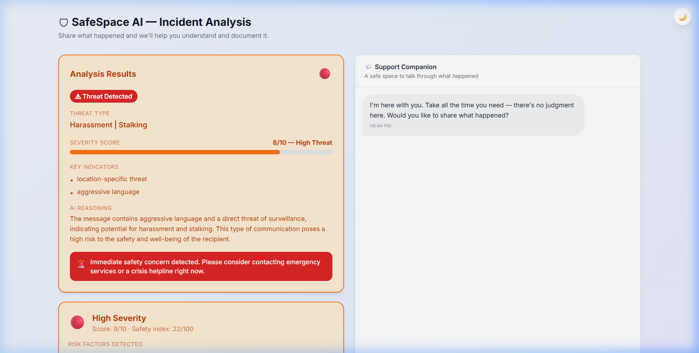
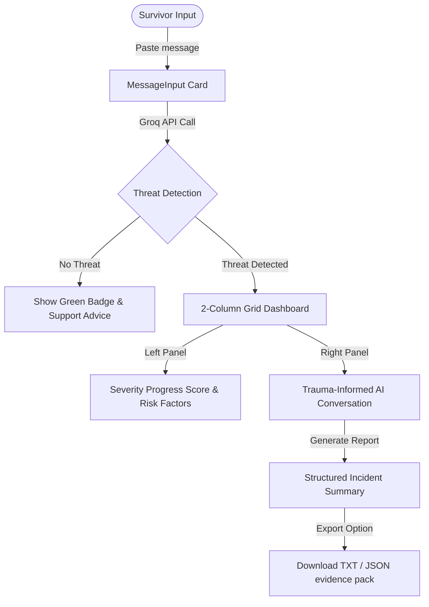

# <p align="center">🛡️ SafeSpace AI</p>

<p align="center">
  <strong>Anonymous, trauma-informed AI sanctuary designed to analyze cyber harassment, assess immediate risk levels, and compile actionable evidence logs.</strong>
</p>

<p align="center">
  <a href="https://safespace-ai-five.vercel.app"></a>
  
  
  
</p>

---

## 📸 Product Preview

<p align="center">
  
</p>

---

## 🌟 Why SafeSpace AI?

Online abuse is fast, targeted, and isolating. SafeSpace AI is built for immediate mitigation and long-term security. It empowers survivors by converting raw, stressful text incidents into **fully formatted evidence packages**, while routing them directly to immediate crisis help.

### Core Pillars
1. **Survivors First:** Entirely anonymous. No backend databases are kept, meaning zero message histories or personal identifiers are stored on servers.
2. **AI-Driven Assessment:** Real-time analysis maps threat categories (doxxing, stalking, blackmail, grooming) and details severity indicators from 1 to 10.
3. **Trauma-Informed Companionship:** An empathetic companion chat window helps users explain their experience and provides guidance.
4. **Actionable Outputs:** Download reports containing formatted summaries, timelines, and localized helplines.

---

## 🛠️ Tech Stack & Integration

*   **Frontend Engine:** React 19 + Vite (TypeScript enabled)
*   **Layout & Aesthetics:** Vanilla CSS + Tailwind CSS (Custom themes configured with glassmorphic cards and dynamic glow transitions)
*   **Animations:** Framer Motion (Staggered element entry, micro-interactions, sun/moon dark mode rotations)
*   **Core AI Engine:** Groq SDK (Llama 3 70B & 8B models for fast, JSON-enforced payloads)

---

## ⚡ Setup & Local Execution

### 1. Clone and Install Dependencies
Ensure Node.js (v18+) is installed.

```bash
# Navigate to project directory
cd safespace-ai

# Install node dependencies
npm install
```

### 2. Add API Configurations
Create a `.env.local` file in the project root:

```env
# Groq SDK Key (Visible to browser during compile time)
VITE_GROQ_API_KEY=your_groq_api_key_here
VITE_APP_ENV=development
```

### 3. Launch Development Server
```bash
npm run dev
```
Open **[http://localhost:3001](http://localhost:3001)** in your browser.

### 4. Build for Production
```bash
# Compile and output assets to /dist
npm run build

# Preview the production build locally
npm run preview
```

---

## 📋 Incident Analysis Workflow



---

## 🔒 Security & Privacy Policy

> [!IMPORTANT]
> **SafeSpace AI stores no personal data.** 
> All API calculations are processed in-memory and all messages are client-side only. Downloading reports or resetting the screen completely clears all active state variables from the browser session.
