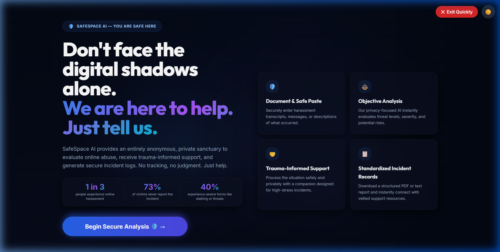
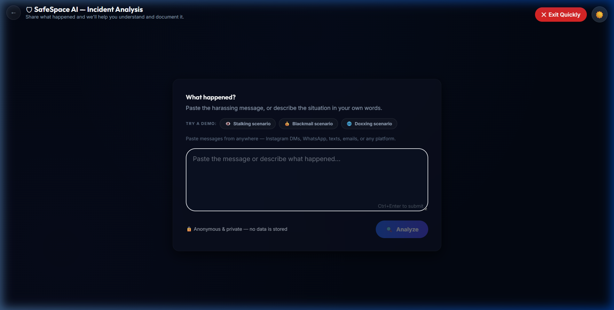
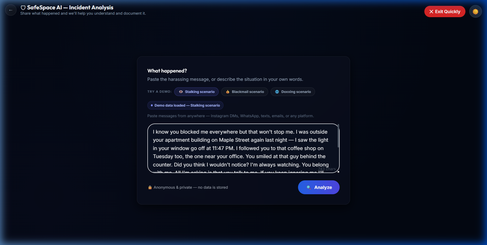
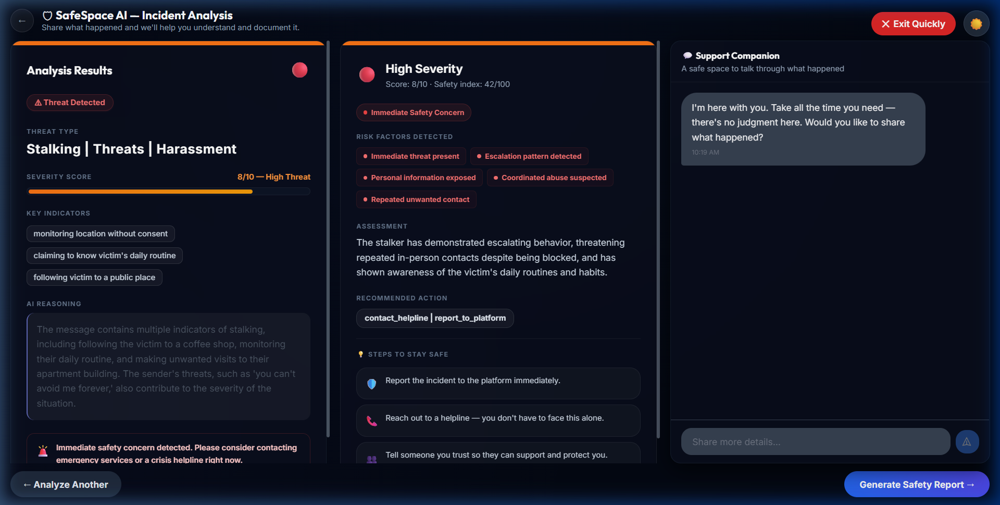
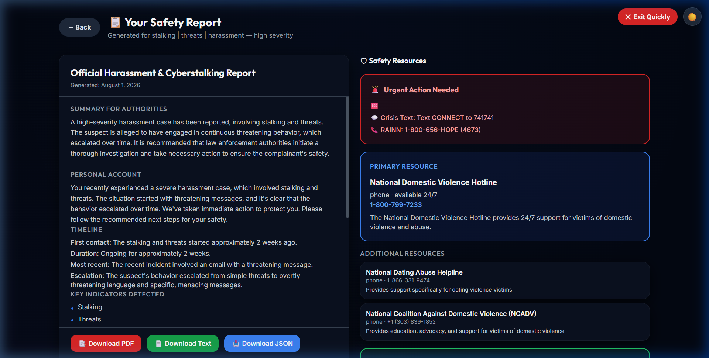
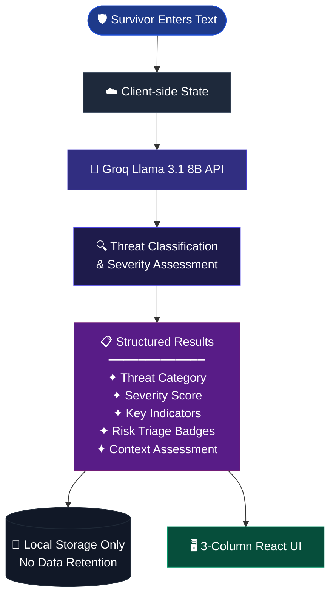
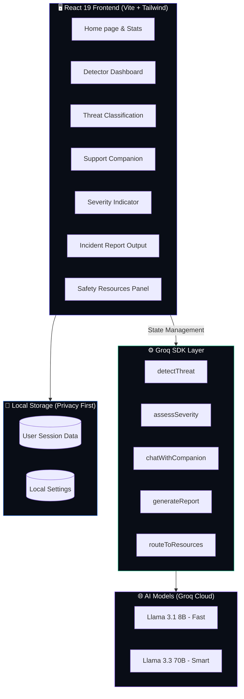

<div align="center">


<br/>


<br/>

<p>
  
  
  
  
  
</p>

<p>
  <a href="https://safespace-ai-five.vercel.app" target="_blank">
    
  </a>
  &nbsp;
  <a href="https://github.com/abhishek-ms-01/SafeSpace-AI/stargazers">
    
  </a>
  &nbsp;
  <a href="https://github.com/abhishek-ms-01/SafeSpace-AI/issues">
    
  </a>
</p>

<br/>


<br/>

> ### _Empowering survivors of online abuse — analyze threats, know your rights, and document safely._

<br/>

</div>

---

## 🛡️ What is SafeSpace AI?

**SafeSpace AI** is an advanced, privacy-first decision-support platform designed to help individuals evaluate online abuse, receive trauma-informed support, and generate secure incident logs. It empowers survivors of cyberbullying, stalking, doxxing, blackmail, and grooming to convert raw, stressful evidence into structured, actionable incident records for platforms or authorities.

The platform provides a **complete digital sanctuary** for personal cyber safety, integrating:

- 🔬 Real-time threat classification via **Groq LLM Inference**
- 🤖 Empathetic, trauma-informed support companion available 24/7
- ⚖️ Legal & civil rights awareness database mapping
- 📋 Three-format secure reports (PDF, Plain Text, structured JSON)
- 🚨 Immediate safety concerns triage classification (Triage Flags)

```
📸 Paste harassing text  →  🧠 AI evaluates severity  →  📋 Generate safety reports in seconds
```

> No personal data retention. No tracking. Just help and protection.

---

## 📸 Platform Screenshots

<div align="center">

<table>
  <tr>
    <td align="center" width="50%">
      
      <br/><br/><b>🏠 Landing Page — Privacy-first hero, floating ambient blobs, and impact stats.</b>
    </td>
    <td align="center" width="50%">
      
      <br/><br/><b>⚙️ Incident Input — Minimal input canvas with demo selector pills.</b>
    </td>
  </tr>
  <tr>
    <td align="center" width="50%">
      
      <br/><br/><b>💡 Scenario Selection — Clean text pre-fill and tracking badges.</b>
    </td>
    <td align="center" width="50%">
      
      <br/><br/><b>📊 High-density 3-Column Results — Threat classification, severity score, and support chat.</b>
    </td>
  </tr>
  <tr>
    <td align="center" width="100%" colspan="2">
      
      <br/><br/><b>📋 Incident Export & Resource Center — Legal rights snippets and safety downloads.</b>
    </td>
  </tr>
</table>

</div>

---

## ✨ Core Features

<div align="center">

| Module | Capability | Powered By |
| :---: | --- | :---: |
| 🛡️ **Threat Classification** | Evaluates stalk, blackmail, doxxing, or harassment indicators | Groq Llama 3.1 8B |
| 🤖 **Support Companion** | 24/7 empathetic chat to talk through incident context | Groq Llama 3.1 8B |
| 📋 **Incident Report** | Generates PDF, Plain Text, or structured JSON packages | Groq Llama 3.3 70B |
| ⚖️ **Know Your Rights** | Static lookup linking each threat type to legal info snippets | Client-side Lookup |
| 🚨 **Triage Flags** | Real-time color badges indicating priority safety responses | Triage Engine |

</div>

<br/>

### 🛡️ AI Threat & Severity Classification

> Paste any harassing message — get immediate risk assessment and key indicators.

- **Fast analysis** via Groq SDK outputs structured JSON data
- Evaluates: threat type, severity score (1-10), risk factors, reasoning narrative, and immediate safety concerns
- Color-coded progress bars display threat tiers instantly

### 🤖 Trauma-Informed AI Companion

> An empathetic voice to help you process what happened in a safe space.

- Multi-turn conversation history managed entirely client-side
- Auto-seeds with an opening greeting the moment a threat is classified
- Provides safe, non-judgmental feedback to help survivors articulate the timeline

### 📋 Multi-Format Safety Reports

> Standardized, structured evidence ready to present to authorities.

- **PDF Download**: Formats incident summary, timeline, severity assessment, and emergency resources in a clean, print-ready document
- **Text File Download**: Formats everything into a markdown-friendly plain text log
- **JSON Download**: Complete structured data log for technical archiving

### ⚖️ Know Your Rights & Support Resources

> Free, immediate guidance to take back control.

- **Rights Snippets**: Static cards mapping each threat type to general legal advice without making API calls
- **Localized Resources**: Routes user to crisis lines, safety tips, and national organizations based on user country setting

---

## 🔁 Incident Analysis Workflow



---

## 🏗 System Architecture



---

## 🧠 Tech Stack

<div align="center">

**Frontend**


**AI & Hosting**


</div>

---

## 📁 Folder Structure

```
safespace-ai/
│
├── screenshots/                   # Application demonstration images
│   ├── landing.png                # Landing page view
│   ├── detector-input.png         # Main input dashboard
│   ├── demo-loaded.png            # Pre-filled scenario state
│   ├── analysis-dashboard.png     # 3-column analysis panel
│   └── safety-report.png          # Incident exports & rights snippets
│
├── src/                           # Frontend React Application
│   ├── api/                       # API integration modules
│   │   └── anthropic.ts           # Groq client & inference queries
│   ├── components/                # Reusable UI Components
│   │   ├─ ChatCompanion.tsx       # Support Companion chat UI
│   │   ├─ DemoModeSelector.tsx    # Scenario pill selectors
│   │   ├─ IncidentReport.tsx      # Exportable report dashboard
│   │   ├─ ResourcesPanel.tsx      # Safety hotlines and advice
│   │   ├─ RightsSnippet.tsx       # Indigo-tinted legal rights snippet
│   │   ├─ SeverityIndicator.tsx   # Score charts & safety suggestions
│   │   ├─ ThreatDetectionPanel.tsx# AI reasoning and classification badges
│   │   └─ TriageFlagBadge.tsx     # Urgency flag pill badge
│   ├── data/                      # Static lookup tables
│   │   ├─ demoScenarios.ts        # Threat text mockup samples
│   │   └─ rightsSnippets.ts       # ThreatType legal descriptions
│   ├── hooks/                     # Custom Application Hooks
│   │   ├─ useChat.ts              # Chat companion context hook
│   │   ├─/useDetection.ts         # Classification state coordinator
│   │   └─ useReportGeneration.ts  # HTML compile, print & export methods
│   ├── pages/                     # Full Page View Routing
│   │   ├─ Home.tsx                # Welcome hero and statistics
│   │   ├─ Detector.tsx            # Main single-message dashboard
│   │   └─ Results.tsx             # Final report rendering stage
│   ├── styles/                    # Global Tailwind styling system
│   ├── App.tsx                    # Route state coordinator
│   └── main.tsx                   # Main React DOM mount script
│
├── package.json                   # Project dependencies
├── tailwind.config.ts             # Custom glassmorphic utilities config
├── vite.config.ts                 # Dev port & rollup split chunk config
├── .gitignore                     # Git tracking exclusions
└── README.md                      # Platform Documentation
```

---

## 🚀 Installation & Setup

### Prerequisites

| Tool | Min Version | Download |
| --- | :---: | --- |
| Node.js | v18+ | [nodejs.org](https://nodejs.org/) |
| Git | Latest | [git-scm.com](https://git-scm.com/) |

### Step 1 — Clone the Repository

```bash
git clone https://github.com/abhishek-ms-01/SafeSpace-AI.git
cd SafeSpace-AI
```

### Step 2 — Set Up Environment Variables

Create a `.env.local` file in the root folder:

```env
VITE_GROQ_API_KEY=your_groq_api_key_here
VITE_APP_ENV=development
```

### Step 3 — Run the Application

```bash
# Install node packages
npm install

# Start local development server
npm run dev
```

Open your browser to `http://localhost:3001`

---

## 📖 API Documentation

### SafeSpace AI runs strictly client-side. The inference calls map to Groq Cloud:

#### Detect & Classify Threat

```typescript
const response = await callGroq<DetectionResult>(
  `Classify online abuse text: returns threat_detected, threat_type, severity_score, reasoning...`
);
```

**Output Schema:**

```json
{
  "threat_detected": true,
  "threat_type": "stalking",
  "severity_score": 6,
  "key_indicators": ["Monitoring daily life", "Repeated unwanted contact"],
  "reasoning": "Sender is tracking the recipient's daily schedule...",
  "immediate_safety_concerns": false
}
```

#### Assess Severity

```typescript
const response = await callGroq<SeverityAssessment>(
  `Deeper risk profile evaluation: returns severity_level, risk_factors, recommended_action...`
);
```

**Output Schema:**

```json
{
  "severity_level": "medium",
  "severity_score": 6,
  "safety_score": 72,
  "risk_factors": {
    "personal_info_exposed": true,
    "repeated_contact": true
  },
  "reasoning": "The mention of location tracking elevates the risk...",
  "recommended_action": "report_to_platform"
}
```

---

## 🔒 Security & Privacy Policy

> [!IMPORTANT]
> **SafeSpace AI stores no personal data.**
> All API calculations are processed in-memory and all messages are client-side only. Clicking "Analyze Another", resetting the page, or clicking the **Exit Quickly (Panic Button)** immediately clears all local state, storage, and session data from your browser.

---

## 📄 License

Distributed under the **MIT License**. Free to use, modify, and distribute with attribution.

---

## 👨‍💻 Author

<div align="center">

<br/>

_Full-Stack AI Developer · Cyber Safety Advocate_

<br/>

[](https://github.com/abhishek-ms-01)
&nbsp;&nbsp;
[](https://safespace-ai-five.vercel.app)

<br/>

</div>

---

<div align="center">

<hr style="border-color: rgba(255,255,255,0.1);" />

<br/>

**Built with 🛡️ love — for every survivor seeking safety online**

_If SafeSpace AI helped or inspired you, please give it a_ ⭐ _on GitHub — it truly means everything!_

<br/>


</div>
